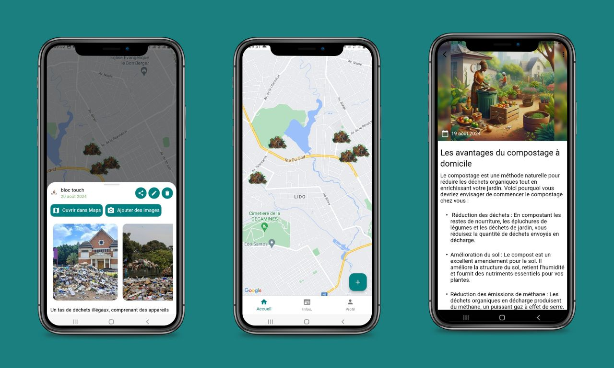

# Clean World

An application that raises awareness about waste management, by detecting places that need to be cleaned up for a healthy environment.

## Features
- Detects on the Map places that need to be cleaned up (by the users)
- Community can add pictures to the places that need to be cleaned up
- Admins can send or schedule notifications on tips for waste management

## Installation

### Google Maps

To use the Google Maps API, you need to create a project on the [Google Cloud Platform](https://cloud.google.com/maps-platform/) and enable the Maps SDK for Android and iOS. Follow the [instructions to get an API key]((https://pub.dev/packages/google_maps_flutter)).
Once you have the API key, you have to add it for each platform.

#### Android

Add the Google Map API key in `android/local.properties` file. If the file does not exist, create it.

```properties
googleMapsApiKey=YOUR_API_KEY
```

### Firebase

This project uses Firebase for Authentication, Storage, Database (Firestore), notifications with Cloud Messaging and Cloud Functions. If you don't already have a Firebase project, you need to [create one](https://firebase.google.com/).

You have to [initialize Firebase](https://firebase.google.com/docs/flutter/setup?platform=ios) in this Flutter project.
Once you did, ensure that there is a `firebase_options.dart` file created in lib folder.

The app uses authentication with Google, follow the instructions to initialize [Firebase Authentication](https://firebase.google.com/docs/auth/flutter/federated-auth).

#### Firestore Indexes

To prevent queries from failing, you need to create the following indexes in Firestore:

| Collection | Fields indexed                                      |
|------------|-----------------------------------------------------|
| clean_news | 	status Ascending __name__ Descending               |
| clean_news | 	status Ascending date Ascending __name__ Ascending |

### Cloud Messaging

The notifications are sent when an admin publish articles or when a scheduled article has been automatically published from the backend, you need to [set up Firebase Cloud Messaging](https://firebase.google.com/docs/cloud-messaging/flutter/client).

## Technologies
- Flutter (Dart)
- Firebase Firestore
- Firebase Storage
- Firebase Cloud Messaging
- Firebase Authentication
- Firebase Cloud Functions
- Google Maps API

The code to schedule notifications is made with Firebase Cloud Functions and is available on this [repository](https://github.com/lyabs243/Clean-World-Functions).

## TODO

All the setup and configuration has been done on Android, the iOS setup is still pending.

Packages to be configured for iOS:
- [google_maps_flutter](https://pub.dev/packages/google_maps_flutter)
- [firebase_core](https://pub.dev/packages/firebase_core)
- [google_sign_in](https://pub.dev/packages/google_sign_in)
- [geolocator](https://pub.dev/packages/geolocator)
- [image_picker](https://pub.dev/packages/image_picker)

## Screenshots

### Global Preview



### Pages

|    |                    |  |
|-------------------------------------------------------------------|---------------------------------------------------------------------------|-----------------------------------------------------------------------------------|
|            |                  |            |
|          |                  |                          |
|                      |                |                    |
|            |  |                    |
|                |                                                                           |                                                                                   |
